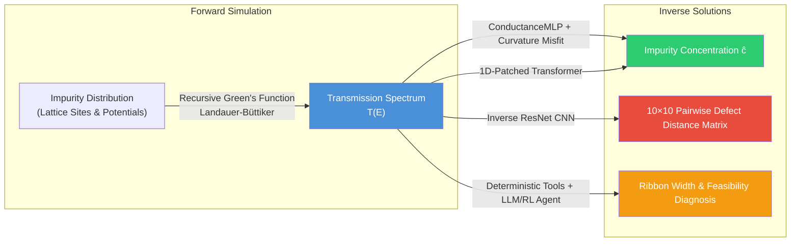

# Quantum Transport Simulation, Inverse Design & Physics-Informed ML

A comprehensive research framework for simulating coherent quantum electron transport through graphene nanoribbons and low-dimensional lattices, solving multi-faceted inverse characterization problems using **Physics-Informed Neural Networks (PINN)**, **1D-Patched Vision Transformers**, **Spatial Defect Reconstruction CNNs**, and **Autonomous Inference Agents**.

---

## Table of Contents
1. [Overview](#overview)
2. [Physical Systems & Forward Simulation](#physical-systems--forward-simulation)
3. [Inverse Problems & Machine Learning Suite](#inverse-problems--machine-learning-suite)
   - [Physics-Informed MLP (PINN with Curvature Misfit)](#1-physics-informed-mlp-pinn-with-curvature-misfit)
   - [1D-Patched Vision Transformer (PatchedTransformerV2)](#2-1d-patched-vision-transformer-patchedtransformerv2)
   - [Spatial Defect Reconstruction (Distance Matrix CNN)](#3-spatial-defect-reconstruction-distance-matrix-cnn)
   - [Tree-Based Baselines (XGBoost)](#4-tree-based-baselines-xgboost)
4. [Autonomous Inference Agent & RL Framework](#autonomous-inference-agent--rl-framework)
5. [Benchmark Results & Comparative Analysis](#benchmark-results--comparative-analysis)
6. [Datasets & Data Infrastructure](#datasets--data-infrastructure)
7. [Repository Structure](#repository-structure)
8. [Getting Started & Usage Guide](#getting-started--usage-guide)

---

## Overview

In mesoscopic quantum electronics, the **forward problem** calculates an energy-dependent transmission spectrum $T(E)$ from a known nanodevice Hamiltonian with a specific impurity configuration. 

The **inverse problem** seeks to infer device properties from an electrical transmission signature:
- **Concentration Prediction**: Estimating the scalar number of disordered impurity atoms $c$ from $T(E)$.
- **Spatial Defect Reconstruction**: Recovering the pairwise Euclidean distance matrix and unit cell site indices of individual scattering centers.
- **Geometry & Width Identification**: Disambiguating nanoribbon width families ($3p, 3p+1, 3p+2$) and band gap signatures under heavy disorder.
- **Autonomous Multi-Step Diagnosis**: Sequential decision-making under simulation budget constraints.



---

## Physical Systems & Forward Simulation

The forward transport solver computes coherent transmission via tight-binding Hamiltonians and the Non-Equilibrium Green's Function (NEGF) / Recursive Green's Function (RGF) formalism.

### Supported Lattice Geometries
| System | Description | Unit Cell Dimensions | Coupling / Hopping |
|---|---|---|---|
| **7-AGNR** (Armchair GNR) | 7-atom-wide armchair graphene nanoribbon | 14 atoms per unit cell ($100$ cells = 1400 sites) | Anti-diagonal intra/inter-cell couplings ($\beta$, $T_1$) |
| **ZGNR** (Zigzag GNR) | Zigzag graphene nanoribbon | $n \times n$ slice | 4-periodic hopping pattern with edge states |
| **Square Lattice** | 2D tight-binding square lattice | $n \times n$ ($n=5, 10, \ldots, 60$) | Nearest-neighbor hopping ($t=1.0$) |

### Formalism
1. **Lead Surface Green's Function ($g_L, g_R$)**: Computed by iterating the Dyson equation until convergence ($tol \le 10^{-6}$):
   $$G^{(n+1)} = \left(I - g \cdot V \cdot G^{(n)} \cdot V^\dagger\right)^{-1} g$$
2. **Device Green's Function**: Built by recursively attaching successive unit cell slices (with random on-site defects $H_{ii} \to H_{ii} - 0.5$) to the leads.
3. **Landauer–Büttiker Transmission**:
   $$T(E) = \text{Tr}\left[\Gamma_L \cdot G^r \cdot \Gamma_R \cdot G^a\right]$$
   where $\Gamma_{L,R} = i\left(\Sigma_{L,R} - \Sigma_{L,R}^\dagger\right)$ are the lead broadening matrices.

---

## Inverse Problems & Machine Learning Suite

```
                                    ┌─► ConductanceMLP (PINN) ───────────► Impurity Concentration ĉ
                                    │
Normalized Spectrum T(E) [B, 200] ──┼─► Patched Transformer (Global Attn) ─► Impurity Concentration ĉ
                                    │
                                    ├─► 1D Inverse ResNet CNN ────────────► 10×10 Defect Distance Matrix
                                    │
                                    └─► XGBoost Regressor ────────────────► Impurity Concentration ĉ
```

### 1. Physics-Informed MLP (PINN with Curvature Misfit)
* **Code**: [`notebooks/agnr/concentration/pinn_agnr_curvature.py`](notebooks/agnr/concentration/pinn_agnr_curvature.py)
* **Checkpoint**: `pinn_agnr_curvature.pt`
* **Architecture**: Fully connected MLP with `LayerNorm`, `ReLU`, and `Dropout(0.2)`:
  $$\text{Linear}(200 \to 256) \to \text{Linear}(256 \to 128) \to \text{Linear}(128 \to 64) \to \text{Linear}(64 \to 32) \to \text{Linear}(32 \to 1)$$
* **Curvature-Weighted Physical Misfit**:
  $$\mathcal{L} = \text{MSE}(\hat{c}, c) + \lambda \cdot \text{CurvatureMisfit}(x, \hat{c})$$
  Evaluates a finite-difference curvature $\kappa$ over the configuration-averaged reference misfit landscape $\text{mis}(c_i) = \frac{1}{N}\sum_E (x_E - R_{c_i,E})^2$:
  $$\kappa = \frac{\text{mis}(c_{i-1}) - 2\,\text{mis}(c_i) + \text{mis}(c_{i+1})}{\Delta c^2}$$
  When the misfit minimum is sharp (high $\kappa$), the physical constraint is amplified; when flat or ambiguous, the penalty is dynamically tempered.

---

### 2. 1D-Patched Vision Transformer (`PatchedTransformerV2`)
* **Code**: [`notebooks/agnr/concentration/patched_transformer_v2.py`](notebooks/agnr/concentration/patched_transformer_v2.py) & [`notebooks/agnr/defect_reconstruction/patched_transformer_model.py`](notebooks/agnr/defect_reconstruction/patched_transformer_model.py)
* **Documentation**: [`notebooks/agnr/docs/patched_transformer_explanation.md`](notebooks/agnr/docs/patched_transformer_explanation.md)
* **Checkpoint**: `patched_transformer_v2.pt`
* **Motivation**: Standard 1D CNNs have local receptive fields and require deep hierarchies to correlate distant spectral features (e.g. Fano resonance dips and band-edge shifts). The Patched Transformer directly models long-range cross-band correlations using global self-attention.
* **Architecture**:
  1. **ConvStem**: `Conv1d(1 → 16, k=7, s=1, p=3) + GELU` extracts fine-scale local slope and edge transitions.
  2. **1D Patch Embedding**: `Conv1d(16 → 64, k=10, s=10)` projects the sequence into $N=20$ non-overlapping 10-point tokens.
  3. **Learned Positional Embeddings**: Injects absolute energy coordinates into each token.
  4. **Transformer Encoder**: 3 Pre-Norm layers with Multi-Head Attention (4 heads, `GELU`, `DropPath`).
  5. **Regression Head**: Operates on the prepend `[CLS]` token $\to$ `Linear(64 → 32) + GELU` $\to$ `Linear(32 → 1)`.

---

### 3. Spatial Defect Reconstruction (Distance Matrix CNN)
* **Code**: [`notebooks/agnr/defect_reconstruction/inverse_model.py`](notebooks/agnr/defect_reconstruction/inverse_model.py)
* **Documentation**: [`notebooks/agnr/docs/walkthrough.md`](notebooks/agnr/docs/walkthrough.md) & [`notebooks/agnr/docs/inverse_model_explanation.md`](notebooks/agnr/docs/inverse_model_explanation.md)
* **Checkpoint**: `distance_matrix_model.pth`
* **Target Output**: $10 \times 10$ matrix representing spatial distribution of up to 10 impurities:
  - **Diagonal $M[i,i]$**: Transverse site index within the unit cell ($0–13$).
  - **Off-Diagonal $M[i,j]$**: Euclidean distance between defect $i$ and defect $j$: $\sqrt{(\Delta \text{cell})^2 + (\Delta \text{site})^2}$.
  - **Sparsity**: Zero-padded rows/columns encode the exact impurity count.
* **Architecture**: 1D ResNet Encoder with strided convolutions $\to 1\times 1$ Bottleneck $\to$ Transposed Convolutional Decoder with learned positional queries.

---

### 4. Tree-Based Baselines (XGBoost)
* **Code**: [`notebooks/agnr/nb/xgb.ipynb`](notebooks/agnr/nb/xgb.ipynb) & [`notebooks/agnr/concentration/train_conc_models.py`](notebooks/agnr/concentration/train_conc_models.py)
* **Architecture & Training**:
  - Uses `xgboost.XGBRegressor` with the hardware-accelerated histogram algorithm (`tree_method="hist"`), `n_estimators=500`, `max_depth=6`, `learning_rate=0.03`, stochastic row subsampling (`0.8`), column subsampling (`0.8`), and $L_2$ regularization (`reg_lambda=1.0`).
  - Explored in `xgb.ipynb` with **Optuna Bayesian optimization** for hyperparameter tuning across both raw 1D transmission curves and statistical feature representations (band-edge onset, spectral variance, mean suppression).
  - Integrated into [`train_conc_models.py`](notebooks/agnr/concentration/train_conc_models.py) as one of the three primary model backends and queryable by [`agnr_agent.py`](notebooks/agnr/agent/agnr_agent.py).

---

## Autonomous Inference Agent & RL Framework

```
                          ┌──────────────────────────────────────────────────────────┐
                          │         Unknown Transmission Signature T(E)              │
                          └────────────────────────────┬─────────────────────────────┘
                                                       │
                                 ┌─────────────────────▼─────────────────────┐
                                 │       Step 1: Deterministic Physics       │
                                 │  - tool_band_gap: Extract onset & index   │
                                 │  - tool_rank_widths: Pristine comparison  │
                                 │  - Filter impossible widths               │
                                 └─────────────────────┬─────────────────────┘
                                                       │
                                 ┌─────────────────────▼─────────────────────┐
                                 │       Step 2: Validation & Decision       │
                                 │  - LLM Reasoning (Gemma via Ollama)       │
                                 │    or Deterministic Fallback Logic        │
                                 └─────────────────────┬─────────────────────┘
                                                       │
                                 ┌─────────────────────▼─────────────────────┐
                                 │       Step 3: Concentration Model         │
                                 │  - Dispatch Width-Specific Model          │
                                 │    (MLP / Transformer / XGBoost)          │
                                 └─────────────────────┬─────────────────────┘
                                                       │
                                 ┌─────────────────────▼─────────────────────┐
                                 │       Step 4: Feasibility Assessment      │
                                 │  - Disorder suppression check             │
                                 │  - Model agreement & confidence scoring   │
                                 └───────────────────────────────────────────┘
```

### Inference Agent (`agnr_agent.py`)
- **Code**: [`notebooks/agnr/agent/agnr_agent.py`](notebooks/agnr/agent/agnr_agent.py)
- **Design**: Separates deterministic physical computation from high-level reasoning. The agent extracts the physical band gap, filters out incompatible pristine geometries from a width library ([`width_id.py`](notebooks/agnr/agent/width_id.py)), queries the appropriate machine learning model, and flags out-of-domain/unfeasible predictions.

### Reinforcement Learning Scheme (`RL_SCHEME.md`)
- **Specification**: [`notebooks/agnr/agent/RL_SCHEME.md`](notebooks/agnr/agent/RL_SCHEME.md)
- Casts device identification into a sequential Markov Decision Process (MDP) under an execution budget:
  - **State $s_t$**: Signature summary, band gap probes, candidate width posterior belief $b_t$, and remaining compute budget.
  - **Discrete Actions $a_t$**: `PROBE_GAP(\theta)`, `REJECT_IMPOSSIBLE`, `SIMULATE(m, c)` (high-cost RGF forward call), `CALL_MODEL(k, m)`, `COMMIT(m, c)`, `ABSTAIN`.
  - **Reward**: Strongly penalizes wrong width classification and wasted simulations while rewarding accurate concentration estimates and honest abstention under extreme disorder.

---

## Benchmark Results & Comparative Analysis

Evaluated on **2,100 held-out test spectra** across concentrations $c \in \{3, 5, \ldots, 43\}$ (generated with [`generate_test_data.py`](notebooks/agnr/physics/generate_test_data.py) and evaluated in [`compare_all_models.py`](notebooks/agnr/concentration/compare_all_models.py) and [`compare_analysis.ipynb`](notebooks/agnr/nb/compare_analysis.ipynb)).

| Model / Method | MAE (impurities) | RMSE (impurities) | Max Error | Type |
|---|---|---|---|---|
| **Patched Transformer v2** | **0.98** | **1.35** | **8.39** | Global Self-Attention (~110k params) |
| **ConductanceMLP (PINN + Curvature)** | **1.18** | **1.53** | **7.47** | Physics-Informed MLP (~95k params) |
| **Physical Misfit Baseline** | 1.92 | 3.02 | 16.00 | Non-learned (Reference Library argmin) |
| **XGBoost Regressor** | 2.07 | 2.90 | 12.98 | Gradient Boosted Trees (`hist`) |

> **Key takeaway**: Deep neural network architectures (Patched Transformer and PINN ConductanceMLP) deliver superior sub-impurity accuracy across the entire spectrum of disorder, significantly outperforming non-learned analytical misfit baselines.

---

## Datasets & Data Infrastructure

The repository contains consolidated dataset pipelines managing over **1,000,000+ simulation configurations**. See [**`README_COMBINED.md`**](README_COMBINED.md) for full dataset specifications.

1. **7-AGNR Combined Dataset** (`transmission_results_combined/`):
   - 740,352 stacked `.npy` transmission curves across 74 concentrations ($c = 1 \dots 98$).
   - Output shape: `(10000, 300)` per concentration file.
2. **Size 10 Square Lattice** (`size_10_combined/`):
   - 326,557 individual simulations merged across 48 concentrations with 400-point energy grids (`0.0` to `3.99`).
3. **Size 25 Nanoribbon** (`transmissions_combined/`):
   - 17,218 simulations merged across 9 concentrations.
4. **Precomputed Leads** (`leads_combined/`):
   - 4,400 complex matrices consolidated into `(400, S, S)` arrays (`complex128`) for system sizes $S \in \{5, 10, 15, \ldots, 60\}$.
5. **Data Merge Script** ([`scripts/combine_storage_data.py`](scripts/combine_storage_data.py)):
   - Parallel multi-threaded merger and validator for processing raw simulation folders.

---

## Repository Structure

```
Inverse_problems_in_QM/
├── README.md                      # Primary repository documentation
├── README_COMBINED.md             # Dataset catalog and NumPy/Pandas loading guide
├── distance_matrix_model.pth      # Pretrained 10x10 defect distance weights (gitignored)
│
├── notebooks/
│   ├── agnr/                      # 7-AGNR Physics, Models & Analysis
│   │   ├── manifest_agnr.csv      # Training manifest (gitignored - generated locally)
│   │   │
│   │   ├── physics/               # Forward simulation & dataset generation
│   │   │   ├── agnr.py            # Tight-binding Hamiltonian & RGF Green's function solver
│   │   │   ├── agnr_lib.py        # Physics utility library (band gap, pristine spectra)
│   │   │   ├── build_leads_agnr.py # Lead surface Green's function generator
│   │   │   ├── build_pristine_library.py # Pristine library generator for widths 5-21
│   │   │   └── generate_test_data.py # Held-out 2100 test dataset generator
│   │   │
│   │   ├── concentration/         # Concentration-inference models & benchmarks
│   │   │   ├── pinn_agnr_curvature.py # ConductanceMLP + CurvatureMisfit regularizer
│   │   │   ├── pinn_agnr_curvature.pt # Pretrained PINN checkpoint (gitignored)
│   │   │   ├── patched_transformer_v2.py # 1D Patched Transformer architecture & training
│   │   │   ├── patched_transformer_v2.pt # Pretrained Transformer checkpoint (gitignored)
│   │   │   ├── train_conc_models.py # Multi-width concentration model training script
│   │   │   └── compare_all_models.py # 4-way evaluation benchmark script
│   │   │
│   │   ├── defect_reconstruction/ # Spatial defect recovery models
│   │   │   ├── inverse_model.py   # Spatial defect distance matrix CNN model
│   │   │   └── patched_transformer_model.py # Transformer backbone for reconstruction
│   │   │
│   │   ├── agent/                 # Autonomous inference agent
│   │   │   ├── agnr_agent.py      # Autonomous inference agent (LLM / deterministic)
│   │   │   ├── width_id.py        # Pristine width matching and possibility filter
│   │   │   └── RL_SCHEME.md       # Reinforcement Learning MDP specification
│   │   │
│   │   ├── sweeps/                # Hyperparameter sweeps
│   │   │   ├── bayesian_opt_sweep.py # Bayesian hyperparameter optimization
│   │   │   └── sweep_misfit_weight.py # Physics loss weight (lambda) parameter sweep
│   │   │
│   │   ├── multi_width/           # Multi-width generalization study & checkpoints
│   │   │
│   │   ├── nb/                    # Analysis notebooks
│   │   │   ├── compare_analysis.ipynb # Comparative benchmark analysis & plotting
│   │   │   └── xgb.ipynb          # XGBoost baseline exploration
│   │   │
│   │   └── docs/                  # Model deep-dives
│   │       ├── walkthrough.md     # Inverse distance matrix model deep-dive
│   │       ├── inverse_model_explanation.md # Distance matrix CNN notes
│   │       └── patched_transformer_explanation.md # Transformer architecture notes
│   │
│   ├── square_lattice/            # 2D Square Lattice Transport Pipeline
│   │   ├── compute_leads_sq.py    # Vectorized lead calculation for square lattices
│   │   ├── ca_sq.py               # Configuration averaging for square systems
│   │   ├── combine_sq.py          # Square lattice data merger
│   │   ├── pipeline_sq.py         # End-to-end automated square lattice pipeline
│   │   └── device.ipynb           # Transport simulation notebook
│   │
│   ├── zgnr/                      # Zigzag GNR Simulation
│   │   ├── zgnr_leads.py          # ZGNR lead Green's function solver
│   │   ├── zgnr_pristine.ipynb    # Pristine band structure & transmission
│   │   └── zgnr_transmission.ipynb# Defect transport simulation
│   │
│   └── extras/                    # Exploratory notebooks and graph models
│
├── scripts/
│   └── combine_storage_data.py    # Production script for merging large simulation dumps
│
├── leads_combined/                # Merged lead Green's functions (sizes 5-60)
│
└── (local only - not tracked in git; see .gitignore)
    ├── data/                      # Raw, processed and held-out test spectra
    ├── models/                    # Trained model checkpoints
    ├── size_10_combined/          # Merged size 10 datasets
    ├── transmission_results_combined/ # Merged 7-AGNR datasets (c=1..98)
    └── transmissions_combined/    # Merged size 25 datasets
```

---

## Getting Started & Usage Guide

### 1. Prerequisites & Environment Setup
```bash
# Clone the repository
git clone https://github.com/mukims/Inverse_problems_in_QM.git
cd Inverse_problems_in_QM

# Install core dependencies
pip install torch numpy scipy pandas matplotlib tqdm xgboost scikit-learn
```

### 2. Running the Autonomous Inference Agent
Classify an unknown transmission spectrum file (`.npy`):
```bash
# Full agent with deterministic physics validation
python notebooks/agnr/agent/agnr_agent.py data/test/transmission_results/7_agnr_conc21_cfg0_test.npy --no-llm

# Evaluate with true ground-truth comparison
python notebooks/agnr/agent/agnr_agent.py data/test/transmission_results/7_agnr_conc21_cfg0_test.npy --true-width 7 --true-conc 21
```

### 3. Evaluating Model Benchmarks
Run the full comparative benchmark (MLP vs Patched Transformer vs XGBoost vs Misfit):
```bash
python notebooks/agnr/concentration/compare_all_models.py
```

### 4. Training the Physics-Informed MLP (PINN)
```python
import numpy as np
import notebooks.agnr.concentration.pinn_agnr_curvature as pinn

# 1. Initialize dataset
pristine = np.load("data/raw/transmission_results/pristine.npy")
dataset = pinn.NormalizedTransmissionsDataset(
    manifest_file='notebooks/agnr/manifest_agnr.csv',
    root_dir='data/raw/transmission_results',
    pristine=pristine,
    spectrum_length=200,
)

# 2. Build curvature-weighted misfit loss module
misfit = pinn.build_misfit_module(
    pristine=pristine,
    conc_range=np.arange(3, 45, 2),
    n_sample_configs=100,
    data_dir='data/raw/transmission_results',
)

# 3. Train model
model, train_losses, val_losses = pinn.train_pinn(
    dataset=dataset,
    misfit_module=misfit,
    num_epochs=200,
    misfit_weight=0.1,  # λ parameter
)
```

### 5. Running the Square Lattice Automated Pipeline
```bash
# Generate leads, simulate disordered configurations, and package datasets
python notebooks/square_lattice/pipeline_sq.py --size 10 --num-configs 5000
```

---

## License
Refer to the [LICENSE](LICENSE) file in the root directory for licensing details.
