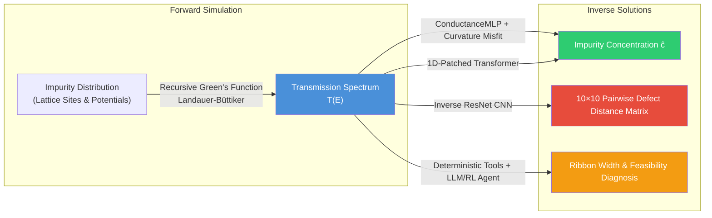

# Quantum Transport Simulation, Inverse Design & Physics-Informed ML

A comprehensive research framework for simulating coherent quantum electron transport through graphene nanoribbons and low-dimensional lattices, solving multi-faceted inverse characterization problems using **Physics-Informed Neural Networks (PINN)**, **1D-Patched Vision Transformers**, **Spatial Defect Reconstruction CNNs**, and **Autonomous Inference Agents**.

---

## Table of Contents
1. [Overview](#overview) · [Current Status & Key Findings](#current-status--key-findings-2026-09-29)
2. [Physical Systems & Forward Simulation](#physical-systems--forward-simulation)
3. [Inverse Problems & Machine Learning Suite](#inverse-problems--machine-learning-suite)
   - [Physics-Informed MLP (PINN with Curvature Misfit)](#1-physics-informed-mlp-pinn-with-curvature-misfit)
   - [1D-Patched Vision Transformer (PatchedTransformerV2)](#2-1d-patched-vision-transformer-patchedtransformerv2)
   - [Spatial Defect Reconstruction (Distance Matrix CNN)](#3-spatial-defect-reconstruction-distance-matrix-cnn)
   - [Tree-Based Baselines (XGBoost)](#4-tree-based-baselines-xgboost)
4. [Autonomous Inference Agent & RL Framework](#autonomous-inference-agent--rl-framework)
5. [Benchmark Results & Comparative Analysis](#benchmark-results--comparative-analysis)
6. [Datasets & Data Infrastructure](#datasets--data-infrastructure)
7. [Repository Structure](#repository-structure)
8. [Getting Started & Usage Guide](#getting-started--usage-guide)

---

## Overview

In mesoscopic quantum electronics, the **forward problem** calculates an energy-dependent transmission spectrum $T(E)$ from a known nanodevice Hamiltonian with a specific impurity configuration. 

The **inverse problem** seeks to infer device properties from an electrical transmission signature:
- **Concentration Prediction**: Estimating the scalar number of disordered impurity atoms $c$ from $T(E)$.
- **Spatial Defect Reconstruction**: Recovering the pairwise Euclidean distance matrix and unit cell site indices of individual scattering centers.
- **Geometry & Width Identification**: Disambiguating nanoribbon width families ($3p, 3p+1, 3p+2$) and band gap signatures under heavy disorder.
- **Autonomous Multi-Step Diagnosis**: Sequential decision-making under simulation budget constraints.


```mermaid
graph LR
    subgraph Forward Simulation
        A["Impurity Distribution<br/>(Lattice Sites & Potentials)"] -->|Recursive Green's Function<br/>Landauer-Büttiker| B["Transmission Spectrum<br/>T(E)"]
    end
    subgraph Inverse Solutions
        B -->|ConductanceMLP + Curvature Misfit| C["Impurity Concentration ĉ"]
        B -->|1D-Patched Transformer| C
        B -->|Inverse ResNet CNN| D["10×10 Pairwise Defect Distance Matrix"]
        B -->|Deterministic Tools + LLM/RL Agent| E["Ribbon Width & Feasibility Diagnosis"]
    end
    style B fill:#4a90d9,color:#fff
    style C fill:#2ecc71,color:#fff
    style D fill:#e74c3c,color:#fff
    style E fill:#f39c12,color:#fff
```

---

## Current Status & Key Findings (2026-09-29)

The full history and every number below are in [`LOGBOOK.md`](LOGBOOK.md). All results here use **held-out configuration seeds** (see Bug #7); earlier random-split numbers were 21–63% too optimistic.

| Finding | Evidence |
|---|---|
| **Concentration is recoverable to ~4–5% of c** from one spectrum (7- and 9-AGNR) | XGBoost on the full 0–3 eV spectrum: MAE 1.977; relative error 4.2–4.8% in every concentration band; 63% of estimates within 5% of c, 92% within 10% |
| **Using the whole spectrum matters more than the model** | Same XGBoost, same test set: 0–1.5 eV MAE 2.396 → 0–3 eV MAE 1.977 (−17.5%). Every main benchmark up to BUILD-10 used only 0–1.5 eV |
| **Model choice matters little once the split is fair** | BUILD-09 (0–1.5 eV): transformer 2.267, XGBoost 2.394, physics misfit 2.442, MLP 2.884 |
| **Impurity arrangement is not recoverable** from one spectrum | Rank correlation between arrangement distance and spectral distance ≈ 0 at c = 20 (9-AGNR) |
| **Autoencoders compress well but add nothing for concentration** | Latent never beats PCA-64 (square: 3.58 vs 3.17 MAE; joint: 2.12/2.80/3.65 vs 1.90/2.58/3.18) |
| **Material and width are identifiable without any label leakage** | Earlier 100% claims used each material's own pristine and were circular (Bug #8). The label-free material atlas (BUILD-12) identifies 7-AGNR / 9-AGNR / Square-10 with **100%** accuracy on 45,450 held-out spectra at every concentration; two physics descriptors (band onset, plateau level) already reach 99.45% |

**Data validity rules** that came out of this work (LOGBOOK Bugs #6–#8):
1. Round T to 3 decimals before dividing by pristine, so band-gap channels become exact zeros.
2. Split by configuration seed, never by random rows: seeds give nested impurity sets across concentrations.
3. Any preprocessing before a classifier must be computable without the label.
4. Check T(E) against the pristine channel count; clipped spikes are 0.36% of AGNR points but reach 29% for the square lattice at c = 90.

---

## Physical Systems & Forward Simulation

The forward transport solver computes coherent transmission via tight-binding Hamiltonians and the Non-Equilibrium Green's Function (NEGF) / Recursive Green's Function (RGF) formalism.

### Supported Lattice Geometries
| System | Description | Unit Cell Dimensions | Coupling / Hopping |
|---|---|---|---|
| **7-AGNR** (Armchair GNR) | 7-atom-wide armchair graphene nanoribbon (3p+1 family) | 14 sites per unit cell ($100$ cells = 1,400 sites) | Anti-diagonal intra/inter-cell couplings ($\beta$, $T_1$) |
| **9-AGNR** (Armchair GNR) | 9-atom-wide armchair graphene nanoribbon (3p family) | 18 sites per unit cell ($100$ cells = 1,800 sites) | As 7-AGNR |
| **ZGNR** (Zigzag GNR) | Zigzag graphene nanoribbon | $n \times n$ slice | 4-periodic hopping pattern with edge states (leads and notebooks only; no disordered dataset yet) |
| **Square Lattice** | 2D tight-binding square lattice strip | width $l$ sites per cell, $100$ cells (width 10 = 1,000 sites) | Nearest-neighbor hopping ($t=1.0$) |

AGNR leads are precomputed for widths 5–31. Impurities are on-site shifts of $V = 0.5$ at randomly chosen sites (`RandomState(config).choice`, so one seed gives nested impurity sets across concentrations). Energies run from $E = 0$ in $0.01$ eV steps (300 channels for AGNR, 400 for the square lattice).

> **Square-lattice data warning:** the width-10 CSVs produced by `notebooks/square_lattice/CA.ipynb` are corrupt: an `lru_cache`d unit-cell matrix was mutated in place, so each impurity persisted into every later cell and 57% of spectra were byte-identical across concentrations. Use data from `ca_sq.py` only (clean width-10 set: `~/transmissions_sq/size_10_combined`, c = 5–90 step 5, 10,000 configurations each).

### Formalism
1. **Lead Surface Green's Function ($g_L, g_R$)**: Computed by Sancho–Rubio decimation or by iterating the Dyson equation until convergence:
   $$G^{(n+1)} = \left(I - g \cdot \tau \cdot G^{(n)} \cdot \tau^\dagger\right)^{-1} g$$
2. **Device Green's Function**: Built by recursively attaching 100 unit-cell slices (with random on-site defects of strength $V = 0.5$) to the left lead, then connecting the right lead.
3. **Transmission**: the code evaluates the trace formula
   $$T(E) = \left|\text{Tr}\left[\tilde G_{LL}\,\tau\,\tilde G_{RR}\,\tau - \tau\,\tilde G^{\text{nl}}\,\tau\,\tilde G^{\text{nl}}\right]\right|, \qquad \tilde G = G - G^\dagger$$
   where $\tau$ is the inter-cell hopping and $G_{LL}$, $G_{RR}$, $G^{\text{nl}}$ are the connected left, right and non-local Green's functions (see `device()` in `ca_sq.py` and `device_transmission()` in `agnr_lib.py`). Unlike the Caroli form $T = \text{Tr}[\Gamma_L G^r \Gamma_R G^a]$, it is not bounded by the channel count, and near subband edges it produces numerical spikes above the pristine value. Pipelines clip normalised spectra to $[0, 1]$ to remove them.

---

## Inverse Problems & Machine Learning Suite

```
                                    ┌─► ConductanceMLP (PINN) ───────────► Impurity Concentration ĉ
                                    │
Normalized Spectrum T(E) [B, L]   ──┼─► Patched Transformer (Global Attn) ─► Impurity Concentration ĉ
                                    │
                                    ├─► 1D Inverse ResNet CNN ────────────► 10×10 Defect Distance Matrix
                                    │
                                    └─► XGBoost Regressor ────────────────► Impurity Concentration ĉ
```

### 1. Physics-Informed MLP (PINN with Curvature Misfit)
* **Code**: [`notebooks/agnr/concentration/pinn_agnr_curvature.py`](notebooks/agnr/concentration/pinn_agnr_curvature.py)
* **Checkpoint**: `pinn_agnr_curvature.pt`
* **Architecture**: Fully connected MLP with `LayerNorm`, `ReLU`, and `Dropout(0.2)`:
  $$\text{Linear}(200 \to 256) \to \text{Linear}(256 \to 128) \to \text{Linear}(128 \to 64) \to \text{Linear}(64 \to 32) \to \text{Linear}(32 \to 1)$$
* **Curvature-Weighted Physical Misfit**:
  $$\mathcal{L} = \text{MSE}(\hat{c}, c) + \lambda \cdot \text{CurvatureMisfit}(x, \hat{c})$$
  Evaluates a finite-difference curvature $\kappa$ over the configuration-averaged reference misfit landscape $\text{mis}(c_i) = \frac{1}{N}\sum_E (x_E - R_{c_i,E})^2$:
  $$\kappa = \frac{\text{mis}(c_{i-1}) - 2\,\text{mis}(c_i) + \text{mis}(c_{i+1})}{\Delta c^2}$$
  When the misfit minimum is sharp (high $\kappa$), the physical constraint is amplified; when flat or ambiguous, the penalty is dynamically tempered.

---

### 2. 1D-Patched Vision Transformer (`PatchedTransformerV2`)
* **Code**: [`notebooks/agnr/concentration/patched_transformer_v2.py`](notebooks/agnr/concentration/patched_transformer_v2.py) & [`notebooks/agnr/defect_reconstruction/patched_transformer_model.py`](notebooks/agnr/defect_reconstruction/patched_transformer_model.py)
* **Documentation**: [`notebooks/agnr/docs/patched_transformer_explanation.md`](notebooks/agnr/docs/patched_transformer_explanation.md)
* **Checkpoint**: `patched_transformer_v2.pt`
* **Motivation**: Standard 1D CNNs have local receptive fields and require deep hierarchies to correlate distant spectral features (e.g. Fano resonance dips and band-edge shifts). The Patched Transformer directly models long-range cross-band correlations using global self-attention.
* **Architecture**:
  1. **ConvStem**: `Conv1d(1 → 16, k=7, s=1, p=3) + GELU` extracts fine-scale local slope and edge transitions.
  2. **1D Patch Embedding**: `Conv1d(16 → 64, k=10, s=10)` projects the sequence into $N=20$ non-overlapping 10-point tokens.
  3. **Learned Positional Embeddings**: Injects absolute energy coordinates into each token.
  4. **Transformer Encoder**: 3 Pre-Norm layers with Multi-Head Attention (4 heads, `GELU`, `DropPath`).
  5. **Regression Head**: Operates on the prepend `[CLS]` token $\to$ `Linear(64 → 32) + GELU` $\to$ `Linear(32 → 1)`.

---

### 3. Spatial Defect Reconstruction (Distance Matrix CNN)
* **Code**: [`notebooks/agnr/defect_reconstruction/inverse_model.py`](notebooks/agnr/defect_reconstruction/inverse_model.py)
* **Documentation**: [`notebooks/agnr/docs/walkthrough.md`](notebooks/agnr/docs/walkthrough.md) & [`notebooks/agnr/docs/inverse_model_explanation.md`](notebooks/agnr/docs/inverse_model_explanation.md)
* **Checkpoint**: `distance_matrix_model.pth`
* **Target Output**: $10 \times 10$ matrix representing spatial distribution of up to 10 impurities:
  - **Diagonal $M[i,i]$**: Transverse site index within the unit cell ($0–13$).
  - **Off-Diagonal $M[i,j]$**: Euclidean distance between defect $i$ and defect $j$: $\sqrt{(\Delta \text{cell})^2 + (\Delta \text{site})^2}$.
  - **Sparsity**: Zero-padded rows/columns encode the exact impurity count.
* **Architecture**: 1D ResNet Encoder with strided convolutions $\to 1\times 1$ Bottleneck $\to$ Transposed Convolutional Decoder with learned positional queries.

---

### 4. Tree-Based Baselines (XGBoost)
* **Code**: [`notebooks/agnr/nb/xgb.ipynb`](notebooks/agnr/nb/xgb.ipynb) & [`notebooks/agnr/concentration/train_conc_models.py`](notebooks/agnr/concentration/train_conc_models.py)
* **Architecture & Training**:
  - Uses `xgboost.XGBRegressor` with the hardware-accelerated histogram algorithm (`tree_method="hist"`), `n_estimators=500`, `max_depth=6`, `learning_rate=0.03`, stochastic row subsampling (`0.8`), column subsampling (`0.8`), and $L_2$ regularization (`reg_lambda=1.0`).
  - Explored in `xgb.ipynb` with **Optuna Bayesian optimization** for hyperparameter tuning across both raw 1D transmission curves and statistical feature representations (band-edge onset, spectral variance, mean suppression).
  - Integrated into [`train_conc_models.py`](notebooks/agnr/concentration/train_conc_models.py) as one of the three primary model backends and queryable by [`agnr_agent.py`](notebooks/agnr/agent/agnr_agent.py).

---

## Autonomous Inference Agent & RL Framework

```
                          ┌──────────────────────────────────────────────────────────┐
                          │         Unknown Transmission Signature T(E)              │
                          └────────────────────────────┬─────────────────────────────┘
                                                       │
                                 ┌─────────────────────▼─────────────────────┐
                                 │       Step 1: Deterministic Physics       │
                                 │  - tool_band_gap: Extract onset & index   │
                                 │  - tool_rank_widths: Pristine comparison  │
                                 │  - Filter impossible widths               │
                                 └─────────────────────┬─────────────────────┘
                                                       │
                                 ┌─────────────────────▼─────────────────────┐
                                 │       Step 2: Validation & Decision       │
                                 │  - LLM Reasoning (Gemma via Ollama)       │
                                 │    or Deterministic Fallback Logic        │
                                 └─────────────────────┬─────────────────────┘
                                                       │
                                 ┌─────────────────────▼─────────────────────┐
                                 │       Step 3: Concentration Model         │
                                 │  - Dispatch Width-Specific Model          │
                                 │    (MLP / Transformer / XGBoost)          │
                                 └─────────────────────┬─────────────────────┘
                                                       │
                                 ┌─────────────────────▼─────────────────────┐
                                 │       Step 4: Feasibility Assessment      │
                                 │  - Disorder suppression check             │
                                 │  - Model agreement & confidence scoring   │
                                 └───────────────────────────────────────────┘
```

### Inference Agent (`agnr_agent.py`)
- **Code**: [`notebooks/agnr/agent/agnr_agent.py`](notebooks/agnr/agent/agnr_agent.py)
- **Design**: Separates deterministic physical computation from high-level reasoning. The agent extracts the physical band gap, filters out incompatible pristine geometries from a width library ([`width_id.py`](notebooks/agnr/agent/width_id.py)), queries the appropriate machine learning model, and flags out-of-domain/unfeasible predictions.

### Reinforcement Learning Scheme (`RL_SCHEME.md`)
- **Specification**: [`notebooks/agnr/agent/RL_SCHEME.md`](notebooks/agnr/agent/RL_SCHEME.md)
- Casts device identification into a sequential Markov Decision Process (MDP) under an execution budget:
  - **State $s_t$**: Signature summary, band gap probes, candidate width posterior belief $b_t$, and remaining compute budget.
  - **Discrete Actions $a_t$**: `PROBE_GAP(\theta)`, `REJECT_IMPOSSIBLE`, `SIMULATE(m, c)` (high-cost RGF forward call), `CALL_MODEL(k, m)`, `COMMIT(m, c)`, `ABSTAIN`.
  - **Reward**: Strongly penalizes wrong width classification and wasted simulations while rewarding accurate concentration estimates and honest abstention under extreme disorder.

---

## Benchmark Results & Comparative Analysis

### Current benchmark: 7- and 9-AGNR, held-out configuration seeds (BUILD-09)
249,000 spectra (3,000 seeds per concentration; 7-AGNR c = 2–68, 9-AGNR c = 2–98), seeds split 70/15/15, 37,350 test spectra, input E = 0–1.49 eV. Results in [`notebooks/agnr/multi_width/seed_split/`](notebooks/agnr/multi_width/seed_split/).

| Model | Concentration MAE | 7-AGNR | 9-AGNR | RMSE | Published random-split MAE (BUILD-06) |
|---|---|---|---|---|---|
| **Patched Transformer v2** (width-conditioned) | **2.267** | 1.871 | 2.542 | 3.274 | 1.390 |
| **XGBoost** | 2.394 | 2.016 | 2.656 | 3.432 | 1.982 |
| **Physics misfit baseline** (no learning) | 2.442 | 1.985 | 2.760 | 3.834 | 2.445 |
| **Multi-task MLP** | 2.884 | 2.454 | 3.182 | 3.673 | 2.018 |

**With the full 0–3 eV spectrum** ([`energy_window_check.py`](notebooks/agnr/multi_width/energy_window_check.py), same XGBoost and test set): MAE 2.396 (0–1.5 eV) → **1.977** (0–3 eV); the upper half alone gives 2.769. Training on all 10,000 seeds instead of 3,000 improves XGBoost only from 2.387 to 2.330 on a common test set.

> **Key takeaway**: once near-duplicate spectra are kept out of the test set, all learned models land close together and only the transformer clearly beats the no-learning physics baseline. Giving models more of the spectrum helps more than changing the model.

### Other results (all held-out seeds)
| Study | Result | Where |
|---|---|---|
| Universal multi-task transformer (BUILD-10), 7-AGNR + 9-AGNR + Square-10 | Concentration MAE 1.855 / 2.551 / 3.126 (type and width accuracy is circular, Bug #8) | [`notebooks/universal_transformer/`](notebooks/universal_transformer/) |
| Square-10 autoencoder | Concentration from the 64-d latent: MAE 3.58 (PCA-64: 3.17, raw spectrum: 3.22) | [`notebooks/square_lattice/sq_ae_results/`](notebooks/square_lattice/sq_ae_results/) |
| Joint autoencoder, all three systems | Reconstruction R² 0.948 / 0.949 / 0.911; concentration MAE 2.12 / 2.80 / 3.65 (PCA-64: 1.90 / 2.58 / 3.18) | [`notebooks/joint_autoencoder/results/`](notebooks/joint_autoencoder/results/) |
| Spectral continuation (BUILD-08) | Predict 1.50–1.69 eV from 0–1.49 eV: LightGBM MSE 0.0213, MLP 0.0218, persistence 0.0477 | [`notebooks/agnr/time_series/build08_baselines.json`](notebooks/agnr/time_series/build08_baselines.json) |

### Historical benchmark (BUILD-04; not comparable)
2,100 freshly generated 7-AGNR test spectra, $c \in \{3, 5, \ldots, 43\}$ ([`generate_test_data.py`](notebooks/agnr/physics/generate_test_data.py), [`compare_all_models.py`](notebooks/agnr/concentration/compare_all_models.py)): Patched Transformer v2 MAE 0.98, ConductanceMLP (PINN) 1.18, physics misfit 1.92, XGBoost 2.07. The narrower concentration range and single width make these numbers much lower than the current benchmark.

---

## Datasets & Data Infrastructure

See [**`README_COMBINED.md`**](README_COMBINED.md) for full dataset specifications. Datasets used by the current models (verified 2026-09-29):

1. **7- and 9-AGNR consolidated spectra** (`transmission_data/transmission_results/consolidated_data/`):
   - `size_7.npy`: shape `(34, 10000, 300)`, c = 2, 4 … 68; `size_9.npy`: shape `(49, 10000, 300)`, c = 2, 4 … 98.
   - Row $i$ of each concentration is configuration seed $i$; energies $E = 0$–$2.99$ eV.
   - Pristine references: `7_agnr_pris.npy`, `9_agnr_pris.npy` (repo root; git-ignored).
2. **Square lattice, width 10 (clean)** (`~/transmissions_sq/size_10_combined/`, from `ca_sq.py` + `combine_sq.py`):
   - `conc_{c}.npy` of shape `(10000, 400)` plus `conc_{c}_meta.csv` (row → config seed), c = 5, 10 … 90.
   - Pristine reference: `~/transmissions_sq/pristine_10.npy`.
   - The older `transmission_data/size_10/lead_size_10_conc_*_config_*.csv` files are **corrupt** (see the warning above).
3. **Precomputed leads**: AGNR widths 5–31 (`~/Desktop/backup/agnr/size_{m}/`); square widths 5, 10 … 50 and 60 (`~/transmissions_sq/leads/`, `leads_combined/`).
4. **Data merge script** ([`scripts/combine_storage_data.py`](scripts/combine_storage_data.py)): parallel merger and validator for raw simulation folders.

---

## Repository Structure

```
Inverse_problems_in_QM/
├── README.md                      # Primary repository documentation
├── LOGBOOK.md                     # Build registry, benchmarks and bug history (source of truth)
├── README_COMBINED.md             # Dataset catalog and NumPy/Pandas loading guide
├── distance_matrix_model.pth      # Pretrained 10x10 defect distance weights (gitignored)
│
├── notebooks/
│   ├── agnr/                      # 7-AGNR Physics, Models & Analysis
│   │   ├── manifest_agnr.csv      # Training manifest (gitignored - generated locally)
│   │   │
│   │   ├── physics/               # Forward simulation & dataset generation
│   │   │   ├── agnr.py            # Tight-binding Hamiltonian & RGF Green's function solver
│   │   │   ├── agnr_lib.py        # Physics utility library (band gap, pristine spectra)
│   │   │   ├── build_leads_agnr.py # Lead surface Green's function generator
│   │   │   ├── build_pristine_library.py # Pristine library generator for widths 5-21
│   │   │   └── generate_test_data.py # Held-out 2100 test dataset generator
│   │   │
│   │   ├── concentration/         # Concentration-inference models & benchmarks
│   │   │   ├── pinn_agnr_curvature.py # ConductanceMLP + CurvatureMisfit regularizer
│   │   │   ├── pinn_agnr_curvature.pt # Pretrained PINN checkpoint (gitignored)
│   │   │   ├── patched_transformer_v2.py # 1D Patched Transformer architecture & training
│   │   │   ├── patched_transformer_v2.pt # Pretrained Transformer checkpoint (gitignored)
│   │   │   ├── train_conc_models.py # Multi-width concentration model training script
│   │   │   └── compare_all_models.py # 4-way evaluation benchmark script
│   │   │
│   │   ├── defect_reconstruction/ # Spatial defect recovery models
│   │   │   ├── inverse_model.py   # Spatial defect distance matrix CNN model
│   │   │   └── patched_transformer_model.py # Transformer backbone for reconstruction
│   │   │
│   │   ├── agent/                 # Autonomous inference agent
│   │   │   ├── agnr_agent.py      # Autonomous inference agent (LLM / deterministic)
│   │   │   ├── width_id.py        # Pristine width matching and possibility filter
│   │   │   └── RL_SCHEME.md       # Reinforcement Learning MDP specification
│   │   │
│   │   ├── sweeps/                # Hyperparameter sweeps
│   │   │   ├── bayesian_opt_sweep.py # Bayesian hyperparameter optimization
│   │   │   └── sweep_misfit_weight.py # Physics loss weight (lambda) parameter sweep
│   │   │
│   │   ├── multi_width/           # Joint 7-/9-AGNR benchmark (BUILD-06 / BUILD-09)
│   │   │   ├── mw_common.py       # Shared loader (--split seed by default), metrics, trainer
│   │   │   ├── mw_misfit.py, mw_xgboost.py, mw_mlp.py, mw_transformer.py, mw_compare.py
│   │   │   ├── energy_window_check.py # 0-1.5 vs 1.5-3 vs 0-3 eV input windows
│   │   │   ├── seed_split/        # Leak-free BUILD-09 results
│   │   │   └── seed_split_10k/    # XGBoost with all 10,000 seeds per concentration
│   │   │
│   │   ├── time_series/           # Spectral sequence continuation & extrapolation
│   │   │   ├── time_series.ipynb      # Autoregressive & tree-based spectral continuation
│   │   │   ├── time_series_nn.ipynb   # Deep neural network multi-output spectral prediction
│   │   │   └── build08_baselines.py   # Comparable persistence / LightGBM / MLP baselines
│   │   │
│   │   ├── nb/                    # Analysis notebooks
│   │   │   ├── compare_analysis.ipynb # Comparative benchmark analysis & plotting
│   │   │   └── xgb.ipynb          # XGBoost baseline exploration
│   │   │
│   │   └── docs/                  # Model deep-dives
│   │       ├── walkthrough.md     # Inverse distance matrix model deep-dive
│   │       ├── inverse_model_explanation.md # Distance matrix CNN notes
│   │       └── patched_transformer_explanation.md # Transformer architecture notes
│   │
│   ├── square_lattice/            # 2D Square Lattice Transport Pipeline
│   │   ├── compute_leads_sq.py    # Vectorized lead calculation for square lattices
│   │   ├── ca_sq.py               # Configuration generator (use this; CA.ipynb has a cache bug)
│   │   ├── combine_sq.py          # Square lattice data merger
│   │   ├── pipeline_sq.py         # End-to-end automated square lattice pipeline
│   │   ├── square_autoencoder.py  # Square-10 autoencoder + concentration probes
│   │   ├── sq_ae_results/         # Its metrics and plots
│   │   └── device.ipynb           # Transport simulation notebook
│   │
│   ├── universal_transformer/     # One model for type, width and concentration (BUILD-10)
│   ├── joint_autoencoder/         # One autoencoder over 7-AGNR, 9-AGNR and Square-10
│   ├── material_atlas/            # Label-free material identification (sensor pipeline stages 1-2)
│   │
│   ├── zgnr/                      # Zigzag GNR Simulation
│   │   ├── zgnr_leads.py          # ZGNR lead Green's function solver
│   │   ├── zgnr_pristine.ipynb    # Pristine band structure & transmission
│   │   └── zgnr_transmission.ipynb# Defect transport simulation
│   │
│   └── extras/                    # Exploratory notebooks and graph models
│
├── scripts/
│   └── combine_storage_data.py    # Production script for merging large simulation dumps
│
├── leads_combined/                # Merged lead Green's functions (sizes 5-60)
│
└── (local only - not tracked in git; see .gitignore)
    ├── data/                      # Raw, processed and held-out test spectra
    ├── models/                    # Trained model checkpoints
    ├── size_10_combined/          # Merged size 10 datasets
    ├── transmission_results_combined/ # Merged 7-AGNR datasets (c=1..98)
    └── transmissions_combined/    # Merged size 25 datasets
```

---

## Getting Started & Usage Guide

### 1. Prerequisites & Environment Setup
```bash
# Clone the repository
git clone https://github.com/mukims/Inverse_problems_in_QM.git
cd Inverse_problems_in_QM

# Install core dependencies
pip install torch numpy scipy pandas matplotlib tqdm xgboost lightgbm scikit-learn
```

### 1b. Reproducing the current results
```bash
# Leak-free 7-/9-AGNR benchmark (held-out seeds are the default)
cd notebooks/agnr/multi_width
python mw_misfit.py && python mw_xgboost.py && python mw_compare.py
python energy_window_check.py            # 0-1.5 vs 1.5-3 vs 0-3 eV

# Universal transformer on all systems (all 10,000 seeds, full 0-3 eV spectrum)
python notebooks/universal_transformer/train_and_evaluate.py --samples-per-conc 10000 --spectrum-len 300 --threads 16

# Label-free material atlas, then locate a spectrum
python notebooks/material_atlas/material_atlas.py --threads 4 --loo
```
On hybrid Intel CPUs, keep PyTorch threads at or below the number of performance cores and never run two large trainings on the same cores: oversubscription made epochs 3–6× slower here.

### 2. Running the Autonomous Inference Agent
Classify an unknown transmission spectrum file (`.npy`):
```bash
# Full agent with deterministic physics validation
python notebooks/agnr/agent/agnr_agent.py data/test/transmission_results/7_agnr_conc21_cfg0_test.npy --no-llm

# Evaluate with true ground-truth comparison
python notebooks/agnr/agent/agnr_agent.py data/test/transmission_results/7_agnr_conc21_cfg0_test.npy --true-width 7 --true-conc 21
```

### 3. Evaluating Model Benchmarks
Run the full comparative benchmark (MLP vs Patched Transformer vs XGBoost vs Misfit):
```bash
python notebooks/agnr/concentration/compare_all_models.py
```

### 4. Training the Physics-Informed MLP (PINN)
```python
import numpy as np
import notebooks.agnr.concentration.pinn_agnr_curvature as pinn

# 1. Initialize dataset
pristine = np.load("data/raw/transmission_results/pristine.npy")
dataset = pinn.NormalizedTransmissionsDataset(
    manifest_file='notebooks/agnr/manifest_agnr.csv',
    root_dir='data/raw/transmission_results',
    pristine=pristine,
    spectrum_length=200,
)

# 2. Build curvature-weighted misfit loss module
misfit = pinn.build_misfit_module(
    pristine=pristine,
    conc_range=np.arange(3, 45, 2),
    n_sample_configs=100,
    data_dir='data/raw/transmission_results',
)

# 3. Train model
model, train_losses, val_losses = pinn.train_pinn(
    dataset=dataset,
    misfit_module=misfit,
    num_epochs=200,
    misfit_weight=0.1,  # λ parameter
)
```

### 5. Running the Square Lattice Automated Pipeline
```bash
# Generate leads, simulate disordered configurations, and package datasets
python notebooks/square_lattice/pipeline_sq.py --size 10 --num-configs 5000
```

---

## License
Refer to the [LICENSE](LICENSE) file in the root directory for licensing details.
