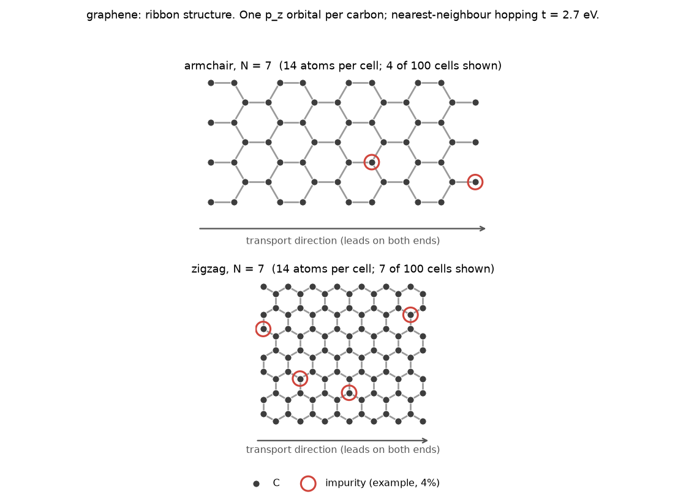
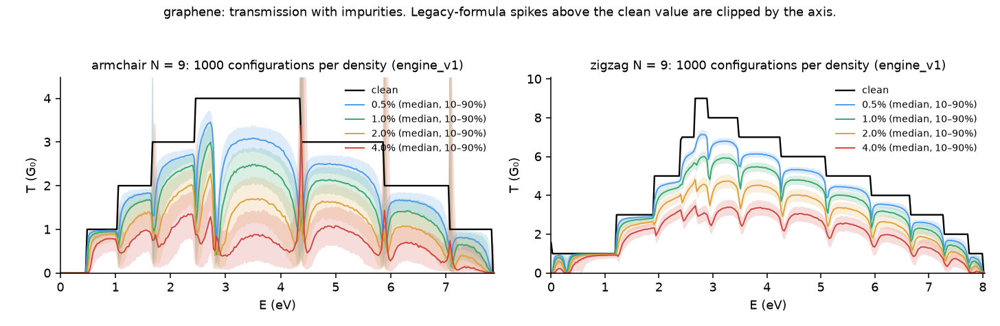

# Inverse Problems in Quantum Transport

We simulate electron transmission T(E) through nanoribbons of 2-D materials, then solve the inverse problem: from one transmission spectrum, read the ribbon's **material, edge, width and impurity density**, and say when a spectrum is unlike anything known.

<table>
<tr><td></td>
<td></td></tr>
<tr><td><sub>Graphene ribbons (armchair, zigzag) with example impurities</sub></td>
<td><sub>Transmission of a graphene ribbon at 0.5–4% impurities</sub></td></tr>
</table>

## Materials

Ribbons are built from geometry with a tight-binding engine. Transmission is computed with recursive Green's functions between clean leads, and impurities are random on-site shifts. Each material has its own page, covering the model, how its data is generated, and figures:

| Material | Model | README |
|---|---|---|
| Graphene | nearest-neighbour p_z, t = 2.7 eV | [graphene](docs/materials/graphene/README.md) |
| hBN | honeycomb with ±Δ on-site (Galvani 2016) | [hbn](docs/materials/hbn/README.md) |
| Phosphorene | 5-hopping model (Rudenko & Katsnelson 2014) | [phosphorene](docs/materials/phosphorene/README.md) |
| MoS₂ | 3-band d-orbital model (Liu et al. 2013) | [mos2](docs/materials/mos2/README.md) |
| Triangular lattice | toy model, one orbital | [triangular](docs/materials/triangular/README.md) |
| Square strip | toy model, one orbital | [square](docs/materials/square/README.md) |

The shared pipeline (transport, disorder, data stores) is described in [`docs/materials/README.md`](docs/materials/README.md).

## Shazam: identifying a spectrum

Shazam is a label-free lookup:
1. It maps every spectrum to the same input: a shared 0–8.3 eV axis, spike removal, and a log scale.
2. It embeds the input with an autoencoder.
3. It finds the 15 nearest reference spectra, which vote for the material, edge and width.
4. A calibrated distance threshold flags spectra it has never seen as **unknown**.
5. For identified spectra, a per-ribbon regressor estimates the impurity concentration, with 90% intervals.

| Held-out test (graphene, 31 ribbons) | Result |
|---|---|
| Material / edge / width identified | 100% / 100% / 99.93% |
| False alarms on known ribbons | about 1% |
| Unseen square lattice flagged as unknown | 100% |
| Concentration on 7/9-AGNR (37,350 spectra) | MAE about 2 impurities, 90% interval coverage 90.0% |

Code: [`notebooks/material_atlas/`](notebooks/material_atlas/).

## Key findings

- **Concentration is recoverable to about 4–5%** of the impurity count from one spectrum, and using the whole spectrum helps more than changing the model.
- **Identification works without label leakage.** Earlier 100% results were circular, because they normalised by the true material's spectrum (Bug #8). Shazam's input is the same for every spectrum.
- **The exact impurity arrangement is not recoverable** from one spectrum, only the count.
- **Checking T against the channel count is not enough.** New ribbon builders must also match the bulk band structure, which caught misplaced MoS₂ bonds (Bug #10).

## Data rules

1. Split train, validation and test **by configuration seed**: a seed's impurities are nested across concentrations (Bug #7).
2. Make everything before identification **label-free** (Bug #8).
3. **Round T to 3 decimals** before dividing by a clean spectrum (Bug #6).
4. Use square-lattice data from `ca_sq.py` only; the `CA.ipynb` CSVs are corrupt.

## Repository

```
notebooks/tbribbon/         tight-binding engine: lattices, leads, transport, disorder, data generation
notebooks/material_atlas/   Shazam: atlaslib, builds, unknown flag, concentration (stage 3)
notebooks/agnr/             earlier 7/9-AGNR models, physics library (agnr_lib.py), agent
notebooks/square_lattice/   square-lattice generator (ca_sq.py) and studies
docs/materials/             one README per material, with figures
tests/                      pytest suite
LOGBOOK.md                  every build, result and bug (source of truth)
```

## Getting started

```bash
pip install torch numpy scipy pandas matplotlib xgboost lightgbm scikit-learn
export PYTHONPATH=notebooks/material_atlas:notebooks

python -m pytest -q                                   # run the tests
python notebooks/tbribbon/generate_clouds.py --help   # generate transmission data
python docs/materials/make_figures.py                 # redraw the material figures
```

## More

- [`LOGBOOK.md`](LOGBOOK.md): all builds, numbers and bug fixes.
- [`docs/agnr-models.md`](docs/agnr-models.md): the earlier 7/9-AGNR models (PINN, transformer, XGBoost), defect reconstruction, the inference agent and the benchmark tables.
- [`README_COMBINED.md`](README_COMBINED.md): the legacy dataset catalogue.

Energies in results before BUILD-21 are in units of the hopping t (graphene: t = 2.7 eV, so "0–3 eV" there means 0–8.1 eV).
