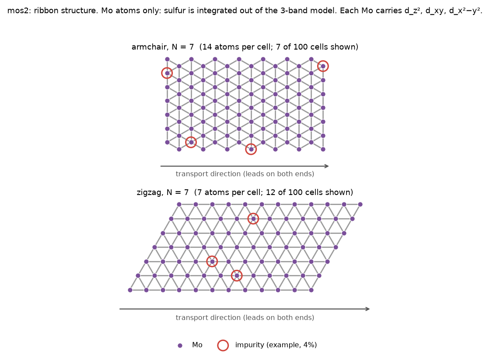
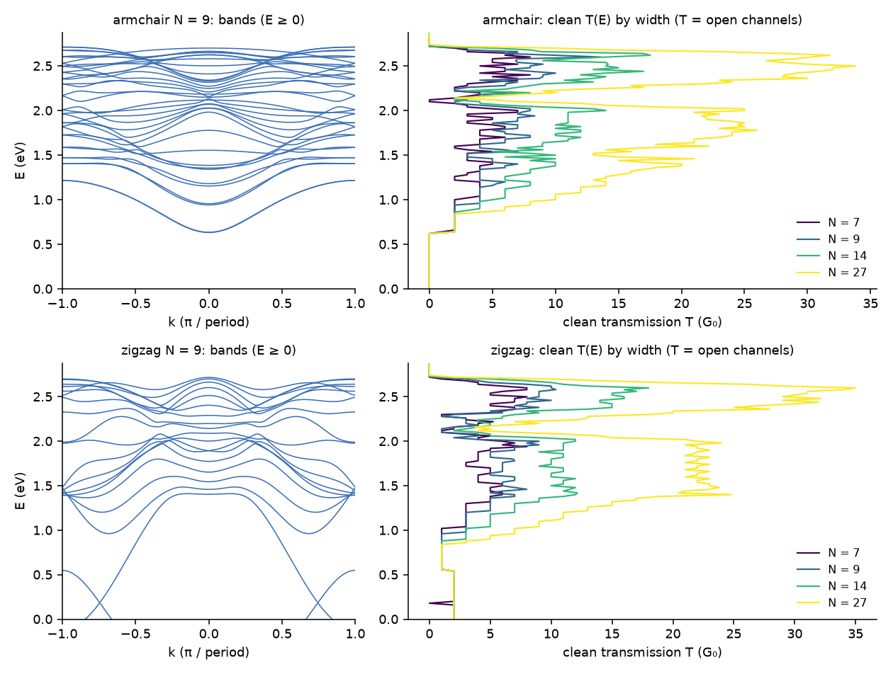
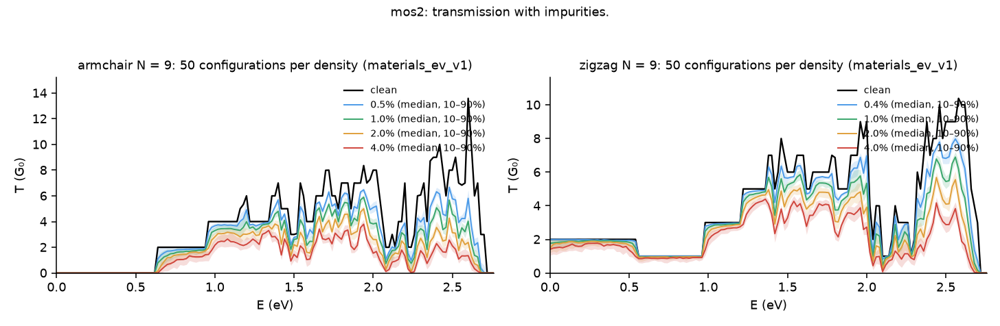

# MoS₂ (`mos2`)

Monolayer MoS₂ nanoribbons in the three-band tight-binding model of Liu et al. This is the only multi-orbital material in the dataset. Shared conventions (device, leads, store, Shazam input) are in the [materials README](../README.md).

## Figures

**Structure**



Ribbon structure at N = 7 (armchair above, zigzag below), drawn with transport running left to right. The device is 100 such cells between leads of the same clean ribbon. Red rings mark one example impurity draw at 4% (seed 0). Only Mo atoms are drawn: sulfur is integrated out of the 3-band model, and each Mo carries three d-orbitals. The zigzag cells are sheared, so the finite segment drawn looks like a parallelogram; the ribbon itself is a straight strip.

**Bands and clean transmission**



Left: bands of N = 9 (E ≥ 0; mid-gap at E = 0). Right: clean transmission for N = 7, 9, 14 and 27. The many flat d-subbands make clean T jump at many energies inside 0.6–2.7 eV. Armchair conduction starts at 0.63 eV (edge states). Zigzag is metallic, with edge bands below about 0.55 eV.

**Transmission with impurities**



N = 9 at 0.5–4% impurities on whole Mo atoms (V = 0.2535 eV): the median and 10–90% band, against the clean spectrum. Smoke store (50 configurations) until FULL-4 finishes.

The figures are made by `docs/materials/make_figures.py` from the code and the stores.

## Physical model

| Item | Value |
|---|---|
| Source | Liu, Shan, Yao, Yao, Xiao, PRB 88, 085433 (2013): three-band, **nearest-neighbour, GGA fit** |
| Atoms | **Mo only**, on a triangular lattice (bond length 1 = a = 3.19 Å). Sulfur is integrated out, and the model has no S orbitals. |
| Orbitals | three per Mo atom: **d_z², d_xy, d_x²−y²**, ordered atom by atom (orbital index = 3·atom + o) |
| On-site | diag(ε₁, ε₂, ε₂) − E_mid, with **ε₁ = 1.046, ε₂ = 2.104, E_mid = 0.7666 eV** |
| Hoppings (eV) | **t0 = −0.184, t1 = 0.401, t2 = 0.507, t11 = 0.218, t12 = 0.338, t22 = 0.057** |
| Hopping matrices | `HR1` along R1 = (1, 0) is `[[t0, t1, t2], [−t1, t11, t12], [t2, −t12, t22]]`. `HR2` along (½, √3/2) and `HR3` along (−½, √3/2) follow by symmetry (`tbribbon/lattices.py:mos2_ribbon`). The opposite bonds use H(−R) = H(R)ᵀ. |
| Units | **energies in eV** (`t_ev = 1.0`); E = 0 at mid-gap (decision D4) |
| Bulk checks | Γ: −0.058 and 2.929 eV (×2); **direct gap at K = 1.663 eV**; C₃ symmetry holds to 3e-15 (`test_mos2_bulk_matches_liu_nn_model`) |
| Window | E ≥ 0 only, so **the valence band is not in the data** (D5) |

**Ribbon numbers** (computed from the code):

| Edge | N | Mo atoms per cell | Orbitals per cell | Conduction onset | Band top | Max channels |
|---|---|---|---|---|---|---|
| armchair | 7 / 9 / 14 / 27 | 14 / 18 / 28 / 54 | 42 / 54 / 84 / 162 | 0.62–0.63 eV (edge states; bulk band edge about 0.83 eV) | 2.70–2.72 eV | 9 / 14 / 18 / 43 |
| zigzag | 7 / 9 / 14 / 27 | 7 / 9 / 14 / 27 | 21 / 27 / 42 / 81 | 0 (metallic edge bands) | 2.71–2.72 eV | 9 / 11 / 18 / 37 |

The whole MoS₂ conduction band fits in 0–2.72 eV, only 137 of the 416 eV channels. Many subband edges are packed into that range, so 7–18% of clean channels are non-integer. The reviewer confirmed this is right: clean T equals the open-channel count from the band structure everywhere except within half a channel of a band edge.

## Ribbon geometry (built from geometry; Bug #10)
- **Zigzag:** N Mo rows. Row i sits at (i/2, i·√3/2), and the period is (1, 0).
- **Armchair:** N columns. Column j holds atom A at (j, 0) and atom B at (j + ½, √3/2), and the period is (0, √3).
- **Bonds.** For every site pair (i, j) and image m ∈ {0, 1}, the builder takes d = p_j + m·period − p_i. If d equals ±R1, ±R2 or ±R3, the matching 3×3 block goes into `H0` (m = 0) or `H1` (m = 1).
- **Verification (Bug #10).** The ribbon bands must lie inside the projected bulk bands; only edge states may fall outside:
  - zigzag N30: 3.8% of states outside;
  - armchair N15: 6.6% outside;
  - both under the 8% bound in `test_mos2_ribbon_bands_lie_in_bulk_projection`.

  The first hand-placed builder (BUILD-19) put the blocks on the wrong bonds, with 56–61% of states outside. `T = N_open` cannot catch that kind of error, which is why the projection test exists.

## Transport
- **Caroli**, device η = 1e-6, `meta.json` formula `caroli`.
- **Leads:** Sancho–Rubio, η = 1e-4.
- **Clean check:** T equals the open-channel count away from subband edges (≤ 1.5e-5 on unmasked channels for armchair N27).

## Energy grid
- **Clean fingerprints** (`materials_v1`): 0–3.99 eV, step 0.01.
- **Clouds:**
  - stored grid: 0–8.30 eV, step 0.02 eV (416 points; `t_ev = 1`, so the stored values are eV);
  - only channels up to 2.72 + 0.01 eV are computed;
  - the rest are exact zeros (no states above the band top).

## Disorder (Bug #11)

| Item | Value |
|---|---|
| Impurity | on-site **+V = 0.2535 eV = 0.5 × t2** added to **all three orbitals of a chosen Mo atom** |
| Count | atoms, not orbitals: `n_imp = round(d × n_Mo)`, with n_Mo = 100 × (N for zigzag, 2N for armchair). Zigzag N14: 7 / 14 / 28 / 56; armchair N14: 14 / 28 / 56 / 112. |
| Placement | `impurity_shifts(..., orbitals_per_site=3)` draws Mo atoms with `RandomState(seed).choice(n_Mo, n_imp, replace=False)`, so impurities are nested across densities |
| Densities | 0.5%, 1%, 2%, 4% |
| Seeds | full run 0–999 (split 0–699 / 700–849 / 850–999); smoke 0–49; probe 0–1 |

Before Bug #11 was fixed, impurities landed on single orbitals with V = 0.5 eV. No cloud was generated before the fix.

## What exists

| Store | Contents | Build |
|---|---|---|
| `~/atlas_store/materials_v1/mos2/` | clean spectra only, N7/9/14/27 × both edges (regenerated after Bug #10) | BUILD-19 / Bug #10 |
| `~/atlas_store/materials_ev_v1/mos2/` | N7/9/14/27 × both edges × 4 densities × 50 seeds; ALL PASS | SMOKE-3 |
| `~/atlas_store/materials_ev_probe/mos2/` | N50 × both edges × 4 × 2 seeds | SMOKE-3 probe |
| `~/atlas_store/materials_ev_full/mos2/` | **N7/9/14 × both edges × 4 densities × 1,000 seeds**. N27 is **not** in the full run (decision F1). | FULL-4 |

**Cost:** single-core seconds per spectrum (SMOKE-3). Armchair carries twice the atoms of zigzag at the same N, and 3 orbitals each.

| Edge | N7 | N9 | N14 | N27 | N50 |
|---|---|---|---|---|---|
| armchair | 1.42 | 3.17 | 11.1 | 79.1 | 235 |
| zigzag | 0.36 | 0.58 | 1.43 | 10.7 | 32.9 |

A full armchair N27 ribbon would take 10–14 h, and armchair N50 about 41 h. That is why both were left out.

## Reproduce

```bash
export PYTHONPATH=notebooks/material_atlas:notebooks OMP_NUM_THREADS=1
~/miniconda3/envs/ml/bin/python -u notebooks/tbribbon/generate_clouds.py --store ~/atlas_store/materials_ev_full --grid materials \
    --materials mos2 --widths 7,9,14 --spec-version v3 --n-seeds 1000 --n-jobs 16
```

## Caveats and choices
- **Nearest-neighbour only:** accurate near ±K, drifting elsewhere (especially in the valence band). Liu's third-nearest-neighbour fit (19 parameters) is not used.
- **No spin–orbit coupling** (λ = 0.073 eV in Liu; it splits the valence band at K by about 0.15 eV).
- **No sulfur:** real edges are often S-terminated, and the commonest real defect is a missing S atom. The disorder here is an on-site shift on Mo atoms. That is fine for testing whether Shazam recognises a new lattice, but it is not a realistic MoS₂ defect model.
- **Energy unit:** t_ev = 1.0 (energies kept in eV) rather than t₂ = 0.507 eV. On the shared eV axis the choice only affects V, which is fixed at 0.5 × t₂.
- **Valence band:** absent (D5). E = 0 is mid-gap (D4), not the valence-band top used in Liu's paper.
