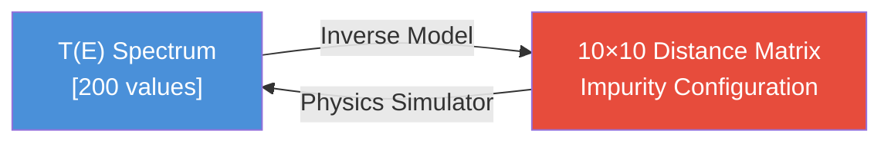
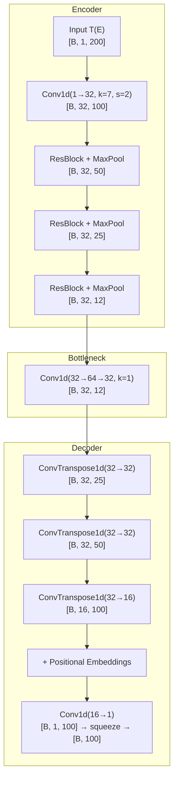
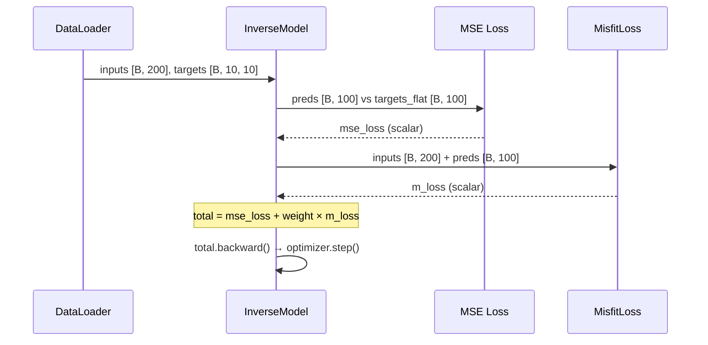

# Inverse Design Model: Distance Matrix Walkthrough

## Overview

This document explains every component of [inverse_model.py](file:///home/shardul/machine_learning/transmission_github/transmissions/notebooks/agnr/inverse_model.py) in detail — the physics behind it, how the data flows, and every change made during this session.

---

## 1. The Physical System: 7-AGNR with Impurities

A **7-AGNR** (7-Armchair Graphene Nanoribbon) is a strip of graphene with a specific edge structure. The key parameters:

| Parameter | Value | Meaning |
|-----------|-------|---------|
| `width` | 7 | AGNR family index |
| Atoms per unit cell | `2 × 7 = 14` | Sites indexed `0–13` |
| Number of unit cells | 100 | Device length |
| `max_conc` | 10 | Maximum impurities we consider |

An **impurity** is a substitutional defect placed at a specific `(unit_cell, site)` coordinate. The function [chosen_for_config](file:///home/shardul/machine_learning/transmission_github/transmissions/notebooks/agnr/agnr.py#L168-L181) in `agnr.py` deterministically picks `n` impurity positions from all `100 × 14 = 1400` possible sites, using the `config` integer as a random seed:

```python
@lru_cache(maxsize=2048)
def chosen_for_config(n: int, width: int, config: int) -> np.ndarray:
    device_combs = _get_device_combs(width)           # All 1400 (unit_cell, site) pairs
    rng = np.random.RandomState(config)
    idx = rng.choice(len(device_combs), size=n, replace=False)
    return device_combs[idx]                           # Shape: [n, 2]
```

The returned array has shape `[n, 2]` where:
- Column 0 = **unit cell index** `[0..99]`
- Column 1 = **site index** `[0..13]`

---

## 2. The Inverse Problem



**Forward problem** (what the physics simulator does): Given impurity positions → compute transmission spectrum T(E).

**Inverse problem** (what our neural network solves): Given T(E) → predict the impurity distance matrix that produced it.

---

## 3. The 10×10 Impurity Distance Matrix

This is the **target** `y` that the model learns to predict. For a sample with `conc` impurities:

### Construction (lines 54–73)

```python
mat = np.zeros((self.max_conc, self.max_conc), dtype=np.float32)  # Always 10×10
if conc > 0:
    imps = agnr.chosen_for_config(n=conc, width=self.width, config=config_id)

    # Off-diagonal: pairwise Euclidean distances
    if conc > 1:
        dists = squareform(pdist(imps.astype(np.float64), metric='euclidean'))
        mat[:conc, :conc] = dists.astype(np.float32)

    # Diagonal: site position within the unit cell
    for i in range(conc):
        mat[i, i] = float(imps[i, 1])
```

### What each element means

| Element | Formula | Physical Meaning |
|---------|---------|-----------------|
| `M[i,i]` | `imps[i, 1]` | Site index of impurity `i` within its unit cell (0–13) |
| `M[i,j]` (i≠j) | `√((uc_i−uc_j)² + (site_i−site_j)²)` | Euclidean distance between impurity `i` and impurity `j` |
| `M[i,j]` where `i ≥ conc` or `j ≥ conc` | `0` | Zero-padded (no impurity in this slot) |

### Concrete Example: `conc = 3`

Suppose 3 impurities at positions `(10, 5)`, `(30, 2)`, `(50, 11)`:

```
         imp_0   imp_1   imp_2   [pad]  [pad]  ...  [pad]
imp_0  [  5.0    20.2    40.1     0      0    ...    0  ]
imp_1  [ 20.2     2.0    20.4     0      0    ...    0  ]
imp_2  [ 40.1    20.4    11.0     0      0    ...    0  ]
[pad]  [  0       0       0       0      0    ...    0  ]
[pad]  [  0       0       0       0      0    ...    0  ]
 ...      ...    ...     ...     ...    ...   ...   ...
[pad]  [  0       0       0       0      0    ...    0  ]
```

Key properties:
- **Symmetric**: `M[i,j] = M[j,i]` (distance is symmetric)
- **Diagonal encodes position**: The site index tells you *where* in the unit cell the impurity sits
- **Off-diagonal encodes separation**: Captures both lateral (across unit cells) and transverse (across sites) distances
- **Sparsity encodes concentration**: The number of non-zero rows/columns reveals how many impurities exist

---

## 4. The Input: Normalised Transmission Spectrum

The input `x` is the transmission spectrum `T(E)`, normalised against the pristine (no-impurity) spectrum:

```python
# Lines 49–52
t_clipped = np.clip(raw_t, 0, self.pristine)
norm_t = np.divide(t_clipped, self.pristine, out=np.zeros_like(t_clipped),
                   where=self.pristine != 0)
x = torch.tensor(norm_t, dtype=torch.float32)   # Shape: [200]
```

- `raw_t`: Raw T(E) with 200 energy points
- `np.clip(raw_t, 0, pristine)`: Clamps values to `[0, T_pristine]` (impurities reduce transmission)
- `norm_t`: Values in `[0, 1]` where `1.0` = pristine transmission, `< 1.0` = impurity-induced reduction

---

## 5. The Model Architecture

### 5.1 Overview



The model outputs **100 values** which are reshaped to a **10×10 matrix** (the predicted distance matrix).

### 5.2 ResBlock1D (lines 160–173)

```python
class ResBlock1D(nn.Module):
    def forward(self, x):
        residual = x                          # Save input
        x = F.relu(self.bn1(self.conv1(x)))   # Conv → BN → ReLU
        x = self.bn2(self.conv2(x))           # Conv → BN
        x += residual                         # Skip connection
        return F.relu(x)
```

Standard residual block. The skip connection prevents gradient vanishing and lets the network learn *corrections* to the identity mapping rather than full transformations.

### 5.3 Encoder (lines 178–189)

Compresses `[B, 1, 200]` → `[B, 32, 12]` through:
1. `Conv1d(1→32, k=7, s=2)` — Captures wide spectral features, halves length: 200→100
2. `ResBlock + MaxPool(2)` — Refine + downsample: 100→50
3. `ResBlock + MaxPool(2)` — 50→25
4. `ResBlock + MaxPool(2)` — 25→12

### 5.4 Bottleneck (lines 191–200)

```python
self.bottleneck = nn.Sequential(
    nn.Conv1d(32, 64, kernel_size=1),   # Channel expansion
    nn.ReLU(),
    nn.Dropout(0.3),
    nn.Conv1d(64, 32, kernel_size=1),   # Channel compression
    nn.ReLU()
)
```

Pointwise (1×1) convolutions that mix channel information without changing spatial dimensions. Acts as a learned "information bottleneck".

> [!IMPORTANT]
> **Bug fix applied**: The original code had `x = x.view(batch_size, 384)` before the bottleneck, flattening the 3D tensor to 2D. This crashed because `Conv1d` expects `[B, C, L]` (3D) input. The fix was removing the unnecessary view calls — the bottleneck already operates on `[B, 32, 12]`.

### 5.5 Decoder (lines 202–217)

Expands `[B, 32, 12]` → `[B, 1, 100]` through transposed convolutions:
1. `ConvTranspose1d(32→32, k=5, s=2)` — 12→25
2. `ConvTranspose1d(32→32, k=4, s=2)` — 25→50
3. `ConvTranspose1d(32→16, k=4, s=2)` — 50→100

**Positional Embeddings** (line 214): A learnable `[1, 16, 100]` tensor added to the decoder output. This gives each of the 100 spatial positions a unique identity, helping the network distinguish *where* in the sequence it's making predictions.

**Final layer**: `Conv1d(16→1, k=3)` maps to single-channel output `[B, 1, 100]`, then `.squeeze(1)` → `[B, 100]`.

### 5.6 Output Interpretation

The 100 output values are the **flattened 10×10 distance matrix**:

```python
# In training:
targets_flat = targets.view(targets.size(0), -1)   # [B, 10, 10] → [B, 100]
loss = F.mse_loss(preds, targets_flat)

# In visualization:
y_pred_mat = preds.reshape(max_conc, max_conc)      # [100] → [10, 10]
```

---

## 6. Loss Functions

### 6.1 MSE Loss (Primary)

```python
mse_loss = F.mse_loss(preds, targets_flat)
```

Directly minimises the element-wise squared error between the predicted and true 10×10 matrices. This is a **regression** loss — appropriate because the target values are continuous (distances and site positions).

### 6.2 MisfitLoss (Physics Constraint) — lines 119–155

The MisfitLoss is a **physics-informed regulariser** that ensures the model's predictions are physically consistent. Here's the full logic step by step:

#### Step 1: Estimate concentration from predicted matrix

```python
pred_mat = predicted_output.view(B, self.max_conc, self.max_conc)
row_norms = torch.norm(pred_mat, dim=2)        # [B, 10]
c_pred = torch.sigmoid(self.scale * (row_norms - 0.5)).sum(dim=1, keepdim=True)  # [B, 1]
```

**Why row norms?** Each row of the distance matrix corresponds to one impurity slot:
- **Active row** (impurity present): Contains the site position on the diagonal + distances to other impurities off-diagonal → **large L2 norm**
- **Empty row** (zero-padded): All zeros → **norm ≈ 0**

The sigmoid with `scale=5.0` converts norms to soft binary indicators:
- `norm > 0.5` → `sigmoid(5 × (norm - 0.5))` ≈ 1 (impurity present)
- `norm ≈ 0` → `sigmoid(5 × (0 - 0.5))` ≈ 0.08 (no impurity)

Summing these gives a **differentiable concentration estimate** `c_pred`.

#### Step 2: Look up expected spectrum for that concentration

```python
dists = (c_pred - self.conc_range.unsqueeze(0)) ** 2
weights = F.softmax(-dists / self.tau, dim=1)    # [B, num_concs]
R_hat = torch.matmul(weights, self.reference_spectra)  # [B, 200]
```

This is a **soft nearest-neighbour lookup**: given `c_pred`, compute how close it is to each known concentration `[1, 2, ..., 10]`. The softmax with temperature `τ=2.0` creates a weighted blend of the precomputed average spectra. If `c_pred ≈ 5`, then the weight for concentration=5 dominates, and `R_hat` ≈ average spectrum for `conc=5`.

#### Step 3: Compare with actual input spectrum

```python
return F.mse_loss(x_input_squeeze, R_hat)
```

If the model predicts a matrix implying 5 impurities, but the input spectrum looks like a `conc=3` spectrum, this loss is high — forcing consistency.

#### Step 4: Combined loss

```python
loss = mse_loss + (misfit_weight × m_loss)
```

The `misfit_weight` (default `0.1`) controls how strongly the physics constraint influences training. Too high → the model focuses on getting concentration right but ignores spatial details. Too low → no physics regularisation.

### 6.3 FocalLoss (Retained but Unused)

```python
class FocalLoss(nn.Module):
    ...
```

This was used in the **old** binary classification approach (predicting which unit cells have impurities). It's retained in the file for reference but not called in the current training loop. Focal loss down-weights easy-to-classify "no impurity" cells (95% of the 100 cells), focusing the network on the rare "impurity present" cells.

---

## 7. Reference Spectra Precomputation (lines 77–94)

```python
def get_reference_spectra(dataset):
```

Before training begins, this function computes the **average T(E) spectrum** for each concentration level (1 through `max_conc`). It samples up to 500 examples per concentration and averages them. These averaged spectra become the lookup table for the MisfitLoss.


---

## 8. Training Loop (lines 246–318)

### Data Flow Per Batch



### Key Training Details

| Component | Setting |
|-----------|---------|
| **Optimizer** | AdamW (lr=7e-4, weight_decay=1e-4) |
| **Scheduler** | CosineAnnealingLR (T_max=num_epochs) — smoothly decays LR to near 0 |
| **Train/Val split** | 80/20 random split |
| **Best model** | Saved when validation loss improves → `../../models/trained/inverse_model.pth` |

---

## 9. Visualization (lines 323–359)

The `visualize_prediction` function produces a 3-panel figure:

1. **Left**: The normalised input spectrum T(E)/T_pristine — shows how much the impurities reduced transmission at each energy
2. **Centre**: The **true** 10×10 distance matrix — ground truth heatmap
3. **Right**: The **predicted** 10×10 distance matrix — model output reshaped to matrix form

Both matrices use the `viridis` colourmap. A good prediction should show similar patterns: matching diagonal values (correct site positions), matching off-diagonal distances, and zeros in the same rows/columns (correct concentration).

---

## 10. Summary of All Changes Made This Session

### Dataset Changes

```diff
-# 1. Dataset: Generates [T(E)] -> [Unit Cell Map] on the fly
+# 1. Dataset: Generates [T(E)] -> [10x10 Impurity Distance Matrix] on the fly

-    def __init__(self, manifest_file, root_dir, pristine, max_conc=10, spectrum_length=200):
+    def __init__(self, manifest_file, root_dir, pristine, max_conc=10, width=7, spectrum_length=200):
+        self.width = width

-        # Re-create spatial unit cell map M
-        imps = agnr.chosen_for_config(n=conc, width=7, config=config_id)
-        x_coords = imps[:, 0]
-        M = np.zeros(100, dtype=np.float32)
-        M[x_coords] = 1.0
-        y = torch.tensor(M, dtype=torch.float32)
+        # Build impurity distance matrix (max_conc x max_conc)
+        mat = np.zeros((self.max_conc, self.max_conc), dtype=np.float32)
+        if conc > 0:
+            imps = agnr.chosen_for_config(n=conc, width=self.width, config=config_id)
+            if conc > 1:
+                dists = squareform(pdist(imps.astype(np.float64), metric='euclidean'))
+                mat[:conc, :conc] = dists.astype(np.float32)
+            for i in range(conc):
+                mat[i, i] = float(imps[i, 1])
+        y = torch.tensor(mat, dtype=torch.float32)
```

### MisfitLoss Adaptation

```diff
-    def forward(self, x_input, predicted_logits):
-        predicted_M = torch.sigmoid(predicted_logits)
-        c_pred = predicted_M.sum(dim=1, keepdim=True)
+    def forward(self, x_input, predicted_output):
+        pred_mat = predicted_output.view(B, self.max_conc, self.max_conc)
+        row_norms = torch.norm(pred_mat, dim=2)
+        c_pred = torch.sigmoid(self.scale * (row_norms - 0.5)).sum(dim=1, keepdim=True)
```

### Model Bug Fix

```diff
-        batch_size = x.size(0)
-        x = x.view(batch_size, 384)       # BUG: Conv1d needs 3D input!
-        x = self.bottleneck(x)
-        x = x.view(batch_size, 32, 12)
+        # Bottleneck: [B, 32, 12] -> [B, 32, 12]
+        x = self.bottleneck(x)             # Conv1d already works on 3D
```

### Training Loop

```diff
-        f_loss = focal_criterion(logits, targets)
-        m_loss = misfit_criterion(inputs, logits)
-        total_loss = f_loss + (misfit_weight * m_loss)
+        mse_loss = F.mse_loss(preds, targets_flat)
+        m_loss = misfit_criterion(inputs, preds)
+        loss = mse_loss + (misfit_weight * m_loss)
```

### Full Change Summary Table

| What changed | Old | New |
|---|---|---|
| **Target shape** | `[100]` binary unit-cell map | `[10, 10]` distance matrix |
| **Target type** | Binary (0 or 1) | Continuous (distances + positions) |
| **Loss** | FocalLoss + MisfitLoss | **MSE** + MisfitLoss |
| **MisfitLoss c_pred** | `sigmoid(logits).sum()` | `sigmoid(scale × (row_norms - 0.5)).sum()` |
| **Bottleneck** | Crashed (2D→Conv1d) | Fixed (3D passes through directly) |
| **Visualization** | Bar chart (binary) | Heatmap comparison (matrices) |
